# Post Bridge — Screenshots

**Post Bridge** is a MERN-stack social media scheduling tool that lets you compose a post once and cross-post it natively to YouTube, LinkedIn, and Instagram, then track it through scheduling and publishing.

> ⚠️ This project is still under active development, so there's no public live demo yet. The screenshots below walk through the current working flow. Live link and video demo will be added once deployment is finalized.

**Tech stack:** React 19 + Vite + Tailwind CSS (frontend) · Express 5 + MongoDB (Mongoose) + JWT auth + Cloudinary + Multer (backend)

---

## 1. Authentication

## landing page
<video controls src="20260815-0701-09.8330318.mp4" title="Title"></video>

### Sign Up Page
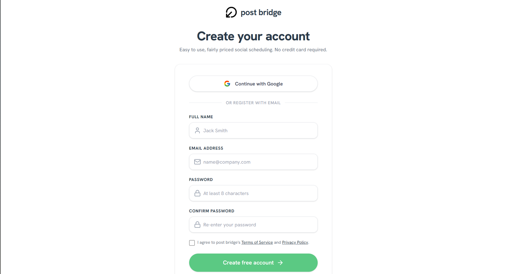

### Login Page
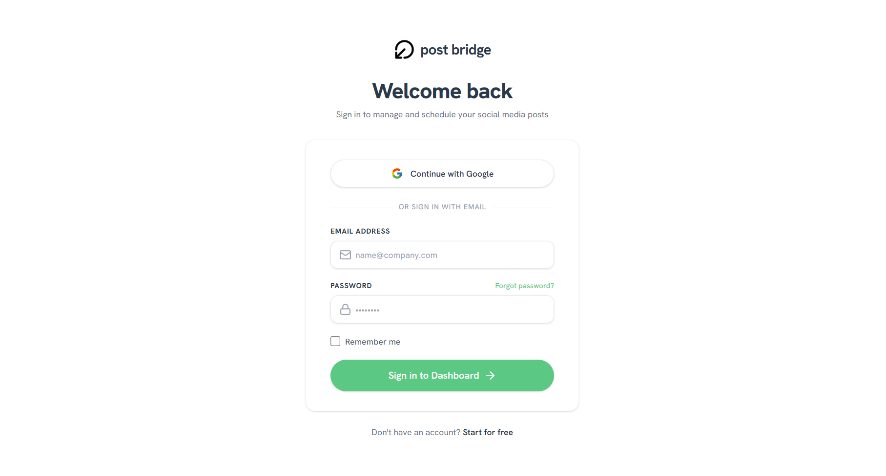

---

## 2. Create a New Post
Choose between a Text, Image, or Video post — each mapped to the platforms that support it (LinkedIn only for text; Instagram/LinkedIn/YouTube for image; YouTube/Instagram/LinkedIn for video).

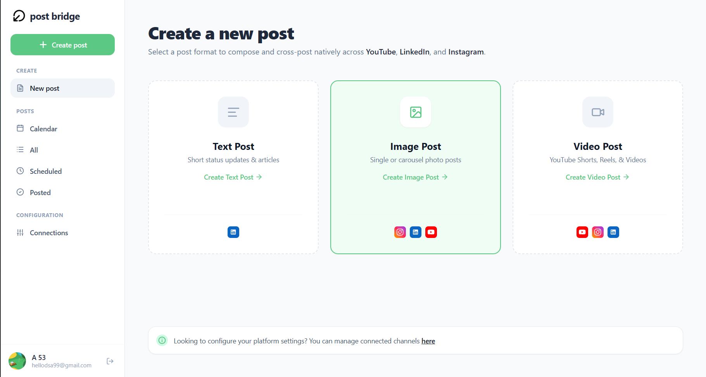
---

## 3. Create Video Post — Select Account & Upload Media
Pick the connected account(s) to post to and drag & drop the video file.

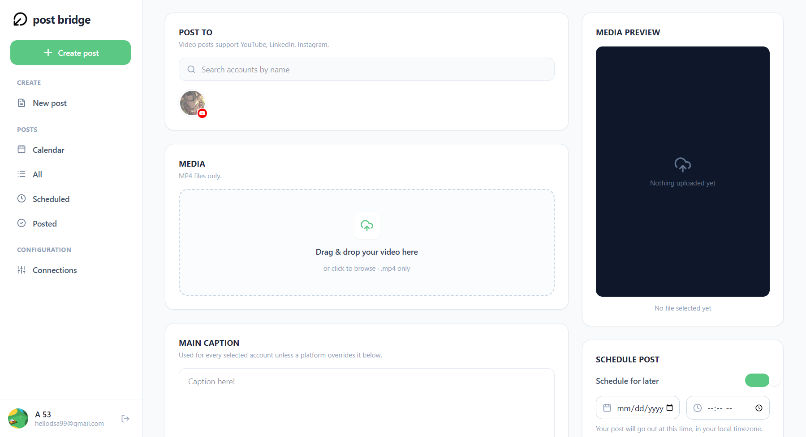

---

## 4. Create Video Post — Caption, Platform Settings & Scheduling
Set a main caption, configure platform-specific fields (e.g. YouTube title & thumbnail), and either publish now or schedule for later.

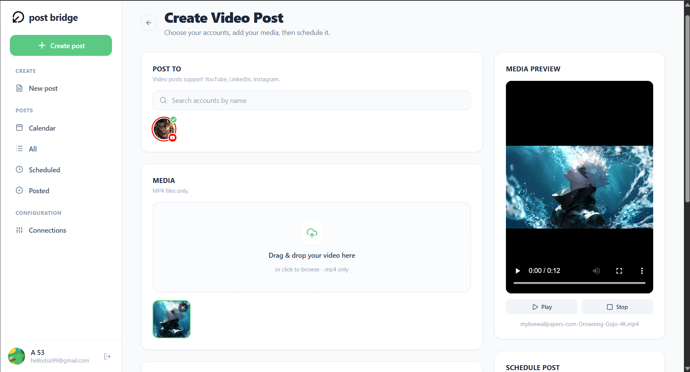
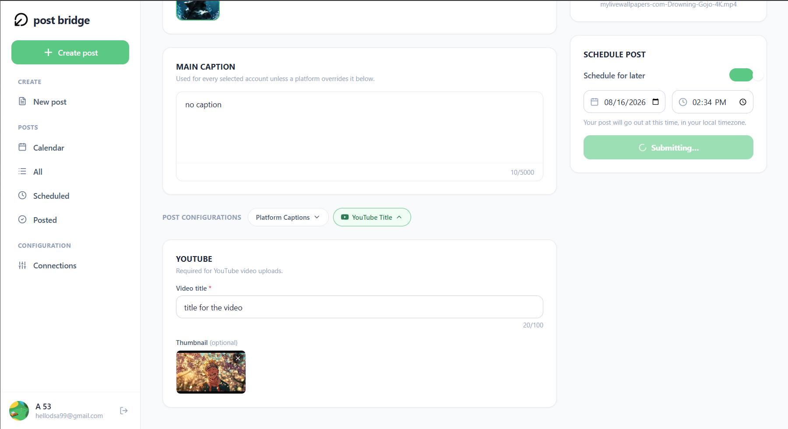

---

## 5. Calendar View
A calendar of all scheduled and published posts, with details for the selected day shown alongside.

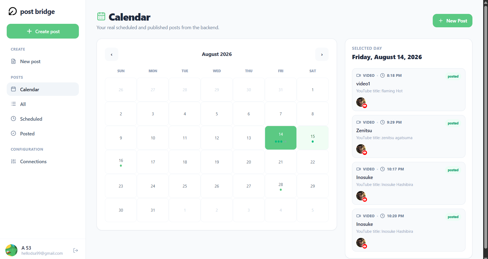

---

## 6. All Posts
A unified view of every draft, scheduled, and published post.

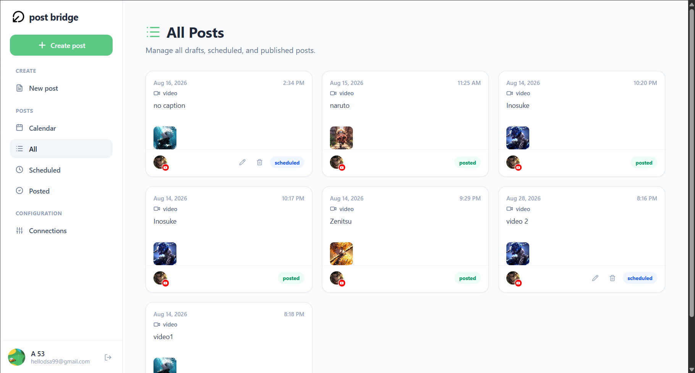

---

## 7. Scheduled Posts
Posts queued for automatic publishing at their scheduled time.

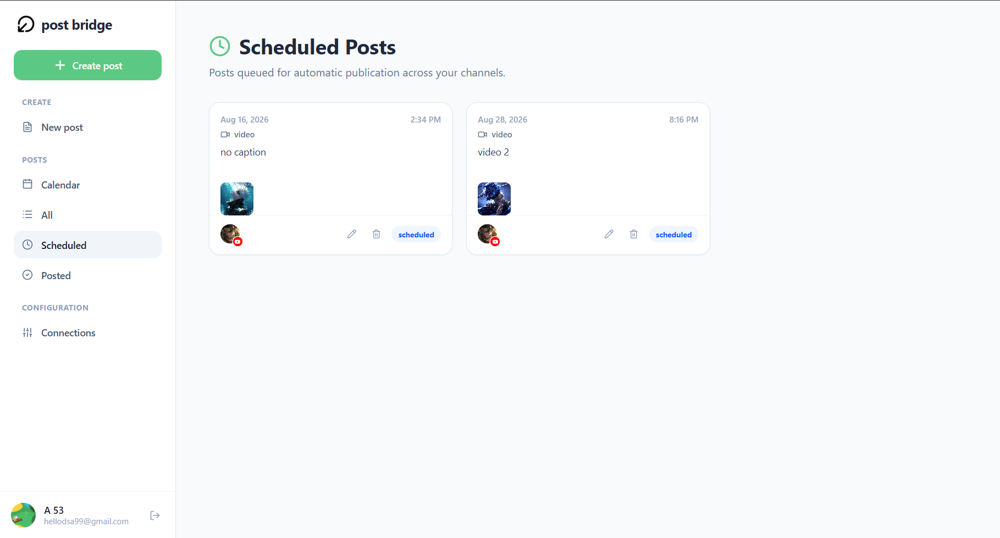

---

## 8. Posted History
History of posts successfully published across connected platforms.

---

## 9. Connected Accounts
Manage YouTube, LinkedIn, and Instagram connections from one place.

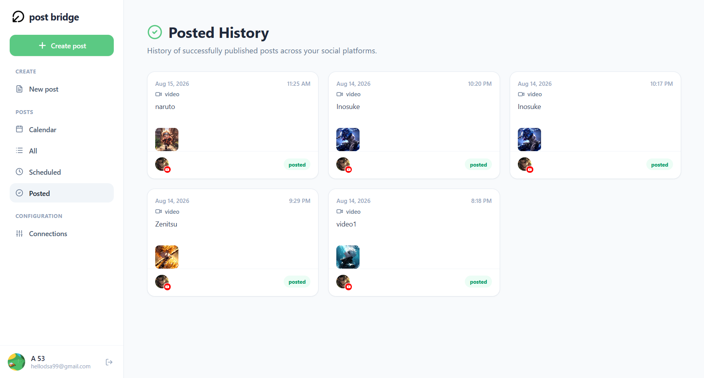

---

## 10. Connect YouTube — OAuth Confirmation
A confirmation modal before redirecting to Google OAuth to link a YouTube channel.

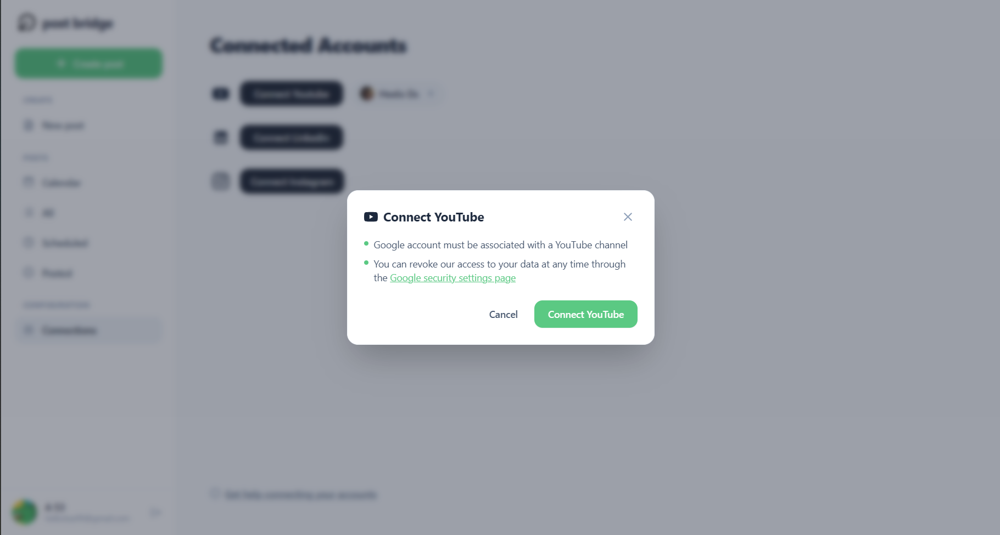
---

## Notes for reviewers
- The app currently supports posting Text, Image, and Video content, each routed to the platforms it's compatible with.
- Posts can be scheduled ahead of time or published immediately, and their status (scheduled/posted) is tracked across the Calendar, All Posts, Scheduled, and Posted History views.
- Account connections use OAuth (currently YouTube is wired up; LinkedIn and Instagram are next).